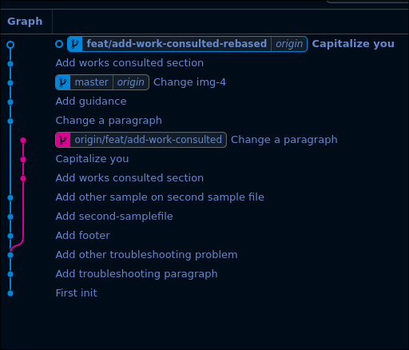
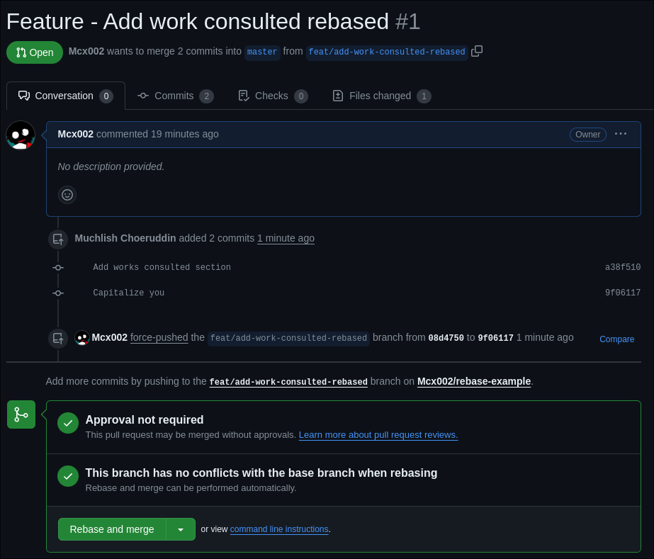

# Guidance

## Intro

If you read this, it means you assigned to practice rebase branch.

This practice require you to clone this [repo](https://github.com/Mcx002/rebase-example).

Disclaimer: this is still happy path tho, But it should be enough for at least provide conflict to solve.

## Fix conflict 1

You will be have a conflict in `samplefile` and you should to fix that. the correct file should be looks like this

## Fix conflict 2

Next You will got a conflict again in `samplefile` and you also should to fix that. the correct file should be looks like this

## Final Result

Expected final result of git log should be looks like this

## Create Pull Request for your branch

This what should it looks like after you create pull request

